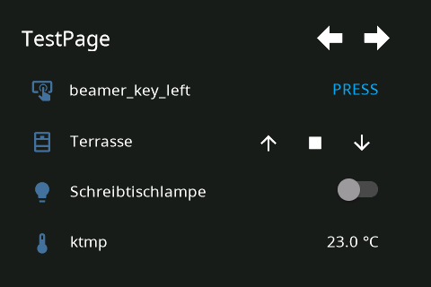
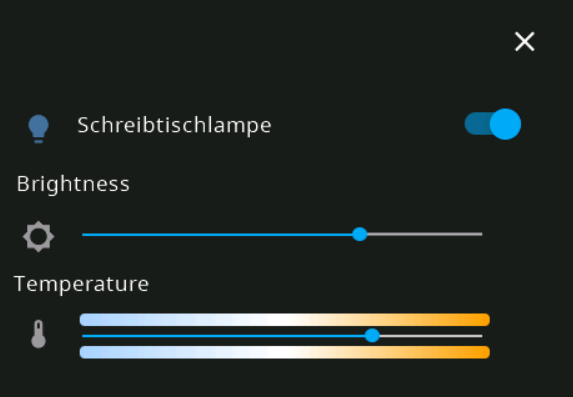
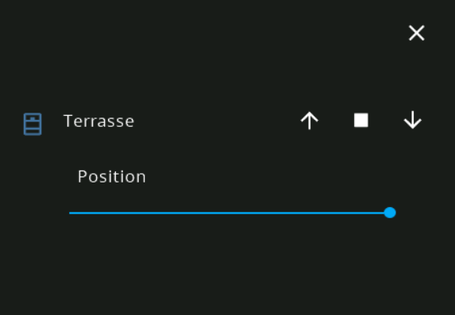
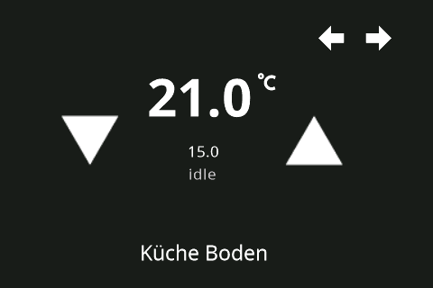

# NSPanel Lovelance UI

<a href="https://paypal.me/joBr99" target="_blank"></a>

This is a custom UI for the NSPanel, with HomeAssistant Lovelance UI Design.

The general idea is that the Nextion Display cycles though a page counter and the esp32 tells the display what to do.
If you are changeing the page the nextion display will send and event to the esp32 and it has to answer with the messages, that will update the current page with it's desired components. This enables easy changes, without touching the HMI Project.

# How to install

## 0. Flash Tasmota

Follow the inststructions to flash tasmota onto the esp32 of your nspanel, make sure to use 'tasmota32-nspanel.bin'.

Before uploading berry driver (nspanel.be/autoexec.be) continue with this guide.

https://templates.blakadder.com/sonoff_NSPanel.html

## 1. Install Nextion Tasmota Berry Driver

Create and edit new file named autoexec.be with a line load("nextion.be") and upload nextion.be from tasmota folder of this repo.

or

Upload "nextion.be" from tasmota folder of this repository and rename to "autoexec.be"

## 2. Flash tft File

Upload the tft file from HMI folder to a Webserver (for example www folder of Home Assistant) and execute the following command in Tasmota Console.
**Webserver needs to support HTTP Range Header Requests, python2/3 http server doesn't work**

`FlashNextion http://192.168.75.30:8123/local/nspanel.tft`

## 3. Setup your Backend

The Backend answers to commands from NsPanel and send's content to display on the screen.

## 3a. AppDeamon Backend (Recommended)

### Installation


### App Configuration

```yaml
nspanel-1:
  module: nspanel-lovelance-ui
  class: NsPanelLovelanceUIManager
  config:
    panelRecvTopic: "tele/tasmota_your_mqtt_topic/RESULT"
    panelSendTopic: "cmnd/tasmota_your_mqtt_topic/CustomSend"
    timeoutScreensaver: 15000
    #brightnessScreensaver: 10
    brightnessScreensaver:
      - time: "7:00:00"
        value: 10
      - time: "23:00:00"
        value: 0
    locale: "de_DE"
    timeFormat: "%H : %M"
    dateFormat: "%A, %d. %B %Y"
    pages:
      - type: cardEntities
        heading: Example Page 1
        items:
          - cover.example_cover
          - switch.example_switch
          - input_boolean.example_input_boolean
          - sensor.example_sensor
      - type: cardEntities
        heading: Example Page 1
        items:
          - button.example_button
          - cover.rolladenterasse_cover_1
          - light.schreibtischlampe
          - delete
      - type: cardThermo
        heading: Exmaple Thermostat
        item: climate.example_climate
      - type: cardMedia
        heading: Exampe Media
        item: media_player.spotify_user
```

key | optional | type | default | description
-- | -- | -- | -- | --
`module` | False | string | | The module name of the app.
`class` | False | string | | The name of the Class.
`config` | False | complex | | Config/Mapping between Homeassistant and your NsPanel


## 3b. Node Red Flow (Deprecated, but functional with limited Feature Set)

Import the example node-red flow from "node-red-example-flow.json" file and adjust to your needs.

# Screens from UI

The following screenshots are from the custom NSPanel UI that will be displayed on NSPanel.







# Message Flow

HomeAssistant / NodeRed -- MQTT -- Tasmota -- Nextion Screen

See the following picture to get an Idea for the messages send and recived from the screen during cycling though pages.


# Custom Protocol

See Readme in HMI Folder for more details on HMI Project / Custom Protocol
