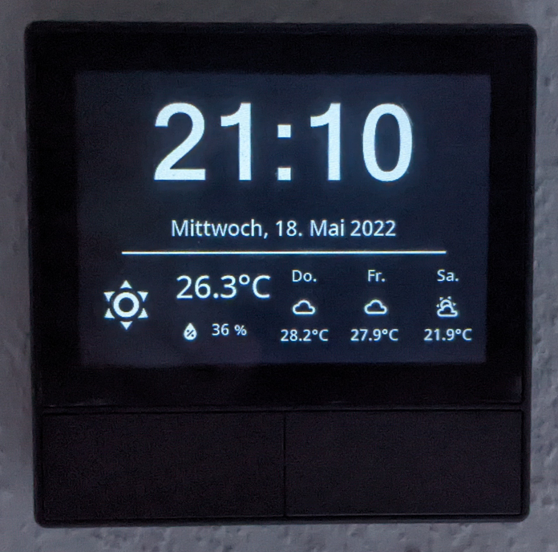
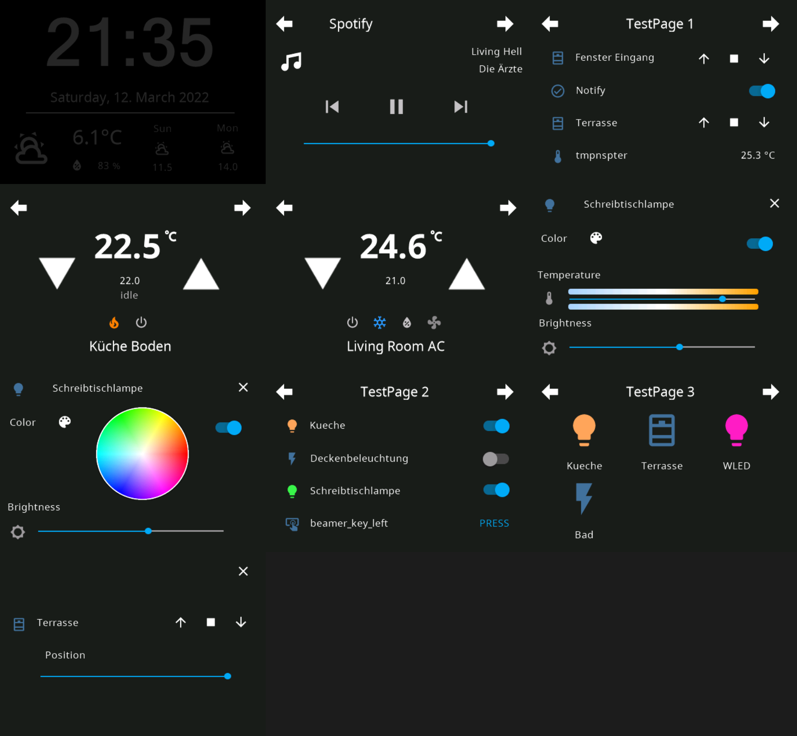

# NSPanel Lovelace UI

If you like this project consider buying me a pizza 🍕 

NsPanel Lovelace UI is a Firmware for the nextion screen inside of NSPanel in the Design of [HomeAssistant](https://www.home-assistant.io/)'s Lovelace UI Design.

**Visit https://docs.nspanel.pky.eu/ for installation instructions and documentation of the configuration.**

Supported Home Automation Systems:

- [Home Assistant](https://docs.nspanel.pky.eu/prepare_nspanel/) - AppDaemon Backend
- [ioBroker](https://docs.nspanel.pky.eu/prepare_nspanel_ioBroker/) - 3rd-party Typescript Backend maintained by @britzelpuf and @Armilar

NsPanel needs to be flashed with Tasmota (or through a 3rd-party Component with ESPHome)

**EU Model and US Model supported (in portrait and landscape orientation)**

## Features

- Entities Page with support for cover, switch, input_boolean, binary_sensor, sensor, button, number, scenes, script, input_button and light, input_text (read-only), lock, fan and automation
- Grid Page with support for cover, switch, input_boolean, button, scenes, light, lock and automation
- Detail Pages for Lights (Brightness, Temperature and Color of the Light) and Covers (Position)
- Thermostat Page 
- Media Player Card
- Alarm Control Card
- Screensaver Page with Time, Date and Weather Information
- Card with QrCode to display WiFi Information
- Localization possible (currently 38 languages)
- **Everything is dynamically configurable by a yaml config, no need to code or touch Nextion Editor**

It works with [Tasmota](https://tasmota.github.io/docs/) and MQTT. 
To control the panel and update it with content from HomeAssistant, there is an [AppDaemon](https://github.com/AppDaemon/appdaemon) App.

See the following picture to get an idea of the look of this firmware for NSPanel.

Some (not all) screenshots from the US Portrait Version:

## Documentation

Visit https://docs.nspanel.pky.eu/ for installation instructions and documentation of the configuration.
