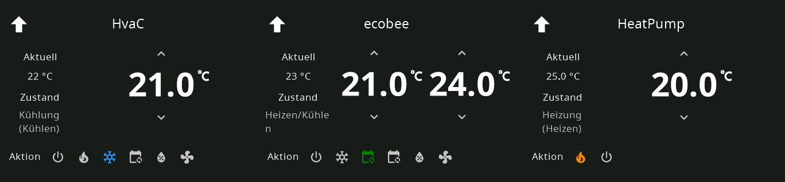

# Climate/Thermo Card



```yaml
    cards:
      - type: cardThermo
        title: HeatPump
        entity: climate.heatpump
      - type: cardThermo
        title: HvaC
        entity: climate.hvac
      - type: cardThermo
        title: ecobee
        entity: climate.ecobee
```

List of supported config keys of this card:

key | optional | type | default | description
-- | -- | -- | -- | --
`type` | False | string | `None` | Type of the card
`entity` | False | string | `None` | contains the entitiy of this card
`title` | True | string | `None` | Title of the Page 
`temperatureUnit` | True | string | `celsius` | set this to fahrenheit to change the temperatureUnit on the page
`key` | True | string | `None` | Used by navigate items in combination with the type (cardEntities_key)
`supportedModes` | True | list | `None` | Supply list of heat actions if you want to limit the actions on the card. Example `['heat', 'off']`
