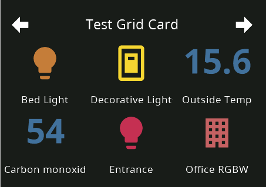

# Grid Page



```yaml
    cards:
      - type: cardGrid
        title: Test Grid Card
        entities:
          - entity: light.bed_light
          - entity: switch.decorative_lights
          - entity: sensor.outside_temperature
            name: Outside Temp
          - entity: sensor.carbon_monoxide
          - entity: light.entrance_color_white_lights
            name: Entrance
          - entity: light.office_rgbw_lights
            name: Office RGBW
            icon: mdi:office-building
```

List of supported config keys of this card:

key | optional | type | default | description
-- | -- | -- | -- | --
`type` | False | string | `None` | Type of the card
`entities` | False | complex | `None` | contains a list of entities of this card
`title` | True | string | `None` | Title of the Page 
`key` | True | string | `None` | Used by navigate items in combination with the type (cardEntities_key)

List of supported entitiy types for this page:

- cover
- switch
- input_boolean
- binary_sensor
- sensor
- button
- number
- input_number
- scenes
- script
- input_button
- light
- input_text (read-only)
- input_select
- lock
- fan
- automation
- iText
