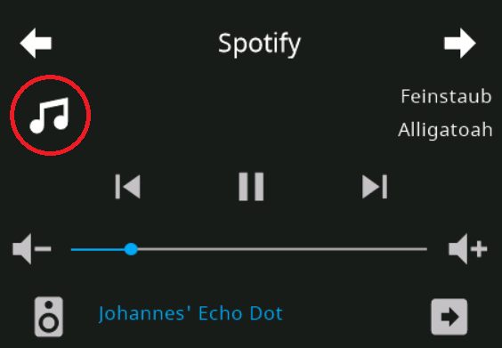

# Media Card



```yaml
    cards:
      - type: cardMedia
        entity: media_player.spotify
```

List of supported config keys of this card:

key | optional | type | default | description
-- | -- | -- | -- | --
`type` | False | string | `None` | Type of the card
`title` | True | string | `None` | Title of the Page 
`entity` | False | string | `None` | contains the entity of the current card
`entities` | False | complex | `None` | contains a list of entities shown in the bottom row, supports all entities supported by cardGrid
`key` | True | string | `None` | Used by navigate items

<details>
<summary>Example with configured Entities</summary>
<br>
```
      - type: cardMedia
        title: Kitchen
        entity: media_player.kitchen
        entities:
          - entity: light.bed_light
          - entity: light.ceiling_lights
          - entity: light.entrance_color_white_lights
          - entity: light.kitchen_lights
          - entity: light.living_room_rgbww_lights
```
</details>

<details>
<summary>Example with action on upper left media icon</summary>
<br>
```
      - type: cardMedia
        title: Kitchen
        entity: input_select.test123
        status: media_player.kitchen
```
</details>

<details>
<summary>Example with moved spaker selection</summary>
<br>
The icon for speaker selection is automatically appended to the end of the list and can be moved with entities in the list.
With 6 entities it is possible to remove it entirely.
```
      - type: cardMedia
        title: Kitchen
        entity: media_player.kitchen
        entities:
          - entity: delete
          - entity: delete
```
</details>