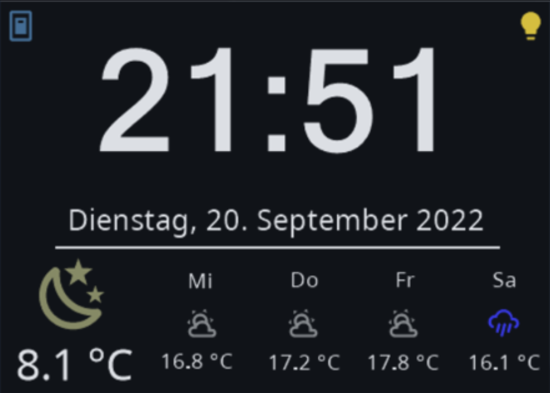
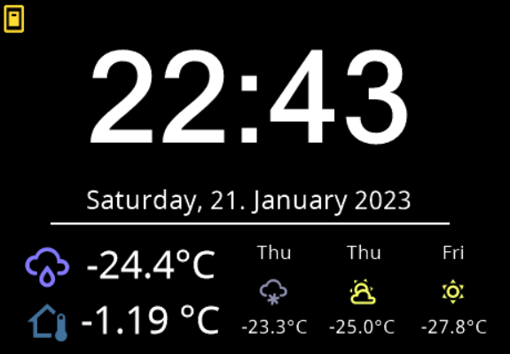

#### Possible configuration values for screensaver config




key | optional | type | default | description
-- | -- | -- | -- | --
`entity` | True | string | `weather.example` | weather entity from homeassistant
`entities` | True | string | `None` | contains a list of entities of this card (will be used instead of entity)
`statusIcon1` | True | complex | `None` | status icon left to the date string, config similar to weatherOverride
`statusIcon2` | True | complex | `None` | status icon right to the date string, config similar to weatherOverride
`doubleTapToUnlock` | True | boolean | `False` | requires to tap screensaver two times
`theme` | True | complex | | configuration for theme
`defaultCard` | True | string | `None` | default page after exiting screensaver; only works with top level cards defined in cards; needs to be a navigation item, see subpages (navigate.type_key) This config option will also be evaluated as a HomeAssistant Template.
`key` | True | string | `None` | Used by navigate items
`type` | True | string | `screensaver` | `screensaver` or `screensaver2`

Example for the a screensaver config with custom entities/overrides:

```yaml
    screensaver:
      entities:
        - entity: weather.demo_weather_north
        - entity: weather.demo_weather_north
          type: 0
        - entity: weather.demo_weather_north
          type: 1
        - entity: weather.demo_weather_north
          type: 2
        - entity: sensor.energy_usage
```


Using a 6th entity will automatically activate the alternative layout.



```yaml
    screensaver:
      entities:
        - entity: weather.demo_weather_north
        - entity: weather.demo_weather_north
          type: 0
        - entity: weather.demo_weather_north
          type: 1
        - entity: weather.demo_weather_north
          type: 2
        - entity: sensor.energy_usage
        - entity: delete
        - entity: sensor.indoor_temp
          icon: mdi:home-thermometer-outline
```

You can use override the options described on the [entities documentation page](https://docs.nspanel.pky.eu/entities/) to override colors, names or values of the entities. 


With Version 4.0.0 there is another alternative layout for the screensaver:

Configuration is similar, you just need to add `type: screensaver2` to switch the layout.


```yaml
    screensaver:
	  type: screensaver2
      entities:
        - entity: weather.demo_weather_north
```


#### Possible configuration values for screensaver theme config (only normal screensaver layout not screensaver2)

key | option | type | default | description
-- | -- | -- | -- | --
`background` | True | list | Black | `[R, G, B]`
`time` | True | list | White | `[R, G, B]`
`timeAMPM` | True | list | White | `[R, G, B]`
`date` | True | list | White | `[R, G, B]`
`tMainText` | True | list | White | `[R, G, B]`
`tForecast1` | True | list | White | `[R, G, B]`
`tForecast2` | True | list | White | `[R, G, B]`
`tForecast3` | True | list | White | `[R, G, B]`
`tForecast4` | True | list | White | `[R, G, B]`
`tForecast1Val` | True | list | White | `[R, G, B]`
`tForecast2Val` | True | list | White | `[R, G, B]`
`tForecast3Val` | True | list | White | `[R, G, B]`
`tForecast4Val` | True | list | White | `[R, G, B]`
`bar` | True | list | White | `[R, G, B]`
`tMainTextAlt2` | True | list | White | `[R, G, B]`
`tTimeAdd` | True | list | White | `[R, G, B]`

Specify colours as red green and blue values from 0-255 e.g. `[255, 0, 0]` for red or `[0, 0, 255]` for blue. These are translated internally to RGB565 (note that this has lower color depth so the colours may not appear the same). Also note that the screen has a low contrast ratio, so colors look sigificantly different at full display brightness and lowest brightness.

Example for the theme config:

```yaml
    screensaver:
      theme:
        date: [255, 0, 0]
```

<details>
<summary>Config Example for configured statusIcons</summary>
<br>
```
    screensaver:
        entity: weather.k3ll3r
        statusIcon1:
          entity: switch.example_item
        statusIcon2:
           entity: binary_sensor.example_item
```
</details>

It is possible to increase the size of the font used for the icons by adding `altFont: True` to the statusIcon configuration. Icon/Color Overrides are also possible like on any other Entity.

<details>
<summary>Config Example for configured statusIcons with increased size of the icons</summary>
<br>
```
    screensaver:
        entity: weather.k3ll3r
        statusIcon1:
          entity: switch.example_item
          altFont: True
        statusIcon2:
           entity: binary_sensor.example_item
           altFont: True
```
</details>

<details>
<summary>Config Example for all white icons on screensaver</summary>
<br>
```
    screensaver:
      entities:
        - entity: weather.demo_weather_north
        - entity: weather.demo_weather_north
          type: 0
	  color: [255,255,255]
        - entity: weather.demo_weather_north
          type: 1
	  color: [255,255,255]
        - entity: weather.demo_weather_north
          type: 2
	  color: [255,255,255]
        - entity: weather.demo_weather_north
          type: 3
	  color: [255,255,255]
```
</details>

<details>
<summary>Config Example for a custom date format on forecast</summary>
<br>
```
   screensaver:
      entities:
        - entity: weather.demo_weather_north
        - entity: weather.demo_weather_north
          type: 0
          name: "%a %-d/%-m"
        - entity: weather.demo_weather_north
          type: 1
          name: "%a %-d/%-m"
        - entity: weather.demo_weather_north
          name: "%a %-d/%-m"
          type: 2
        - entity: weather.demo_weather_north
          name: "%a %-d/%-m"
          type: 3
```

See Babel Documentation (https://babel.pocoo.org/en/latest/dates.html#date-fields) or the Python Documenation (https://docs.python.org/3/library/datetime.html#strftime-and-strptime-format-codes) in case you do not have babel installed.

</details>

